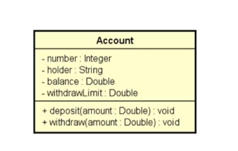

# Exception Handling

Create a program to read the data from a bank account and then make a withdrawal from this bank account, showing the new balance. A withdrawal cannot occur
either if there is no balance in the account, or if the withdrawal amount is higher than the account's withdrawal limit.

Implement the bank account according to the project below:



The program should behave as follows:

```
Enter account data
Number: 8021
Holder: Bob Brown
Initial balance: 500.00
Withdraw limit: 300.00

Enter amount for withdraw: 100.00
New balance: 400.00

or

Enter account data
Number: 8021
Holder: Bob Brown
Initial balance: 500.00
Withdraw limit: 300.00

Enter amount for withdraw: 400.00
Withdraw error: The amount exceeds withdraw limit

or

Enter account data
Number: 8021
Holder: Bob Brown
Initial balance: 500.00
Withdraw limit: 300.00

Enter amount for withdraw: 800.00
Withdraw error: The amount exceeds withdraw limit

or

Enter account data
Number: 8021
Holder: Bob Brown
Initial balance: 200.00
Withdraw limit: 300.00

Enter amount for withdraw: 250.00
Withdraw error: Not enough balance
